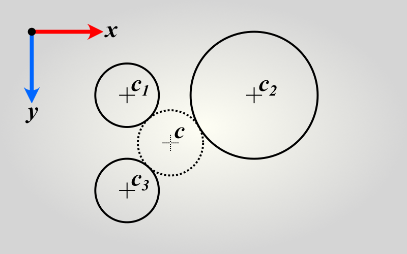
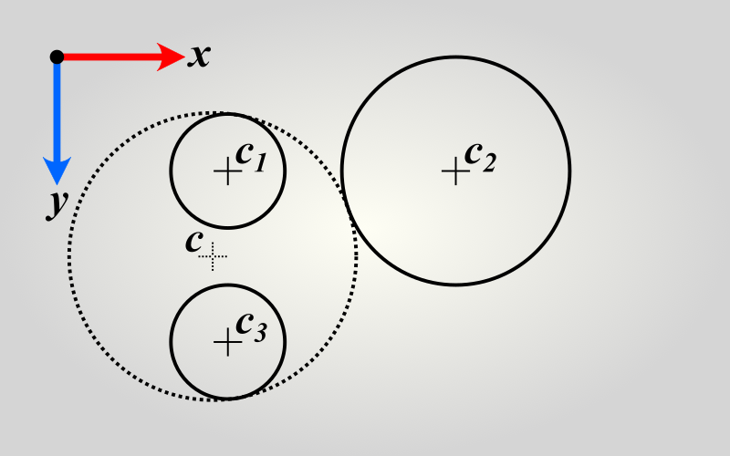

# apollonius



[](https://www.npmjs.com/package/apollonius)
[](https://github.com/axelpale/apollonius/actions/workflows/apollonius-ci.yml)
[](#license)


The `apollonius` module provides a function to find a circle that touches three known circles. The resulting circle is an exact solution to the [Problem of Apollonius](https://en.wikipedia.org/wiki/Problem_of_Apollonius) also known as *apollonian problem*. In other words, it finds a circle that is *tangent* to each of the known three circles. The function is robust: the known circles can be placed freely and are allowed to overlap each other.

Because a circle can be either internally or externally tangent to another circle, the problem of Apollonius has eight solutions in total, one for each combination of tangency rules of the three circles. The function here finds one solution per call but can be configured to find all eight.

The function is very efficient. It has time complexity of *O(1)* and does not call any trigonometric functions.

Try out [the demo!](https://axelpale.github.io/apollonius/demo.html)

[Installation](#installation) – [Usage](#usage) – [Special Cases](#special-cases) – [API](#api) – [Contribute](#contribute)


## Installation

Install via [NPM](https://www.npmjs.com/package/apollonius) or [Yarn](https://yarnpkg.com/package?name=apollonius). The package supports [CommonJS](https://en.wikipedia.org/wiki/CommonJS), [ESM](https://developer.mozilla.org/en-US/docs/Web/JavaScript/Guide/Modules), and [UMD](https://github.com/umdjs/umd) module formats and ships with [TypeScript](https://www.typescriptlang.org/) type declarations.

```
$ npm install apollonius
```

Then import the module in one of the following ways:

```
// ESM wildcard
import * as apollonius from 'apollonius'
// ESM default export
import solve from 'apollonius'
// ESM named export
import { solve } from 'apollonius'
// CommonJS module
const apollonius = require('apollonius')
```

Alternatively, install via a [script tag](https://developer.mozilla.org/en-US/docs/Web/HTML/Element/script). Either download a minified bundle from [releases](https://github.com/axelpale/apollonius/releases) and host it alongside your HTML, like below, or use [Unpkg CDN](https://www.unpkg.com/).

```
<script src="apollonius-1.2.3.min.js" defer></script>
<script>
  document.addEventListener('DOMContentLoaded', () => {
    // ...
    var circle = apollonius.solve(...)
    // ...
  })
</script>
```

[Unpkg CDN](https://www.unpkg.com/) URL is good for some quick hands-on development but it is not recommended for production:

```
<script src="https://www.unpkg.com/apollonius/dist/apollonius.min.js" defer></script>
...
```

The bundle declares the global variable `window.apollonius`. Usage of [defer](https://developer.mozilla.org/en-US/docs/Web/HTML/Element/script#defer) attribute and [DOMContentLoaded](https://developer.mozilla.org/en-US/docs/Web/API/Document/DOMContentLoaded_event) event is optional although a good convention.


## Usage

Specify your three known circles as `{ x, y, r }` objects, where `x` and `y` are the circle center coordinates and `r` is the radius. Then call the function `apollonius.solve` with the circles. The order of the circles does not matter.

```
// Prepare three known circles.
const c1 = { x: 3, y: 2, r: 1 }
const c2 = { x: 7, y: 2, r: 2 }
const c3 = { x: 3, y: 5, r: 1 }

// Compute a fourth circle that touches the three.
const c = apollonius.solve(c1, c2, c3)

// Result equals { x: 4.367544..., y: 3.5, r: 1.029822... }
```

The result is a circle object `{ x, y, r }` or `null` if such a circle cannot be found. By default, the resulting circle is **externally tangent** to each of the three given circles. To find a circle that is **internally tangent** to some of the circles, specify those circles with negative radius. See below for an example.

```
// Prepare circles.
const c1 = { x: 3, y: 2, r: -1 }  // r < 0, thus internally tangent
const c2 = { x: 7, y: 2, r: 2 }  // externally tangent
const c3 = { x: 3, y: 5, r: -1 }  // r < 0, thus internally tangent

// Compute the fourth circle.
const c = apollonius.solve(c1, c2, c3)

// Result equals { x: 2.732213..., y: 3.5, r: 2.523715... }
```

The circle configuration above is illustrated as follows:


_**Figure:** The resulting circle `c` is internally tangent to the known circles `c1` and `c3` and externally tangent to the known circle `c2`._

Note that while the known circles can have negative radii, the output circle always has positive or zero radius.


## Special cases

The fourth circle cannot be found for some configurations of known circles. The function will then return `null`. These configurations may appear when there are:

- **nested circles:** a circle cannot be internally or externally tangent two or more nested circles at the same time.
- **identical circles along a line:** when three same-size circles are arranged along a straight line, the radius of the tangent circle would go to infinity and thus its radial center could not be defined.

These unsolvable configurations are illustrated below.

 nested circles; b) circles along a line")
_**Figure:** cases of unavailable solution and infinite-radius solution. The wicks mark the tangency rules of the circles. A) no tangent circle can be found that is tangent to a circle and two nested circles at the same time. B) if the tangency points form a straight line then the solution circle radius becomes infinite._

In addition, the fourth circle may reduce to a point (a circle with zero radius) in some configurations of known circles. These configurations may appear when there are:

- **identical stacked circles:** The known circles are exact copies of each other. Then the externally tangent circle reduces to an arbitrary point on the shared circumference of the known.
- **circles intersect at a single point:** The known circles share only one common point. Then the externally tangent circle reduces to that point.

These zero radius yielding configurations are illustrated below.

 stacked circles; b) circles intersect at a point")
_**Figure:** cases of infite number of solutions and a zero-radius solution. A) In theory, a stack of three identical circles have an infinite number of solutions of arbitrary radius. The function will arbitrarily pick a zero-radius point at the common circumference. B) Unique zero-radius solution can be found at the mutual intersection point of all three circles._

For further details, see [Special cases of Apollonius' problem](https://en.wikipedia.org/wiki/Special_cases_of_Apollonius%27_problem) at Wikipedia.


## API

### apollonius.solve(c1, c2, c3)

This function finds a circle that is tangent to three other circles. If no such circle exists, it returns null.

Parameters:
- c1
  - an object `{ x, y, r }`, representing a circle in 2D. The properties `x`, `y`, and `r` must be real numbers and are allowed to be negative.
- c2
  - an object `{ x, y, r }`, representing a circle in 2D. The properties `x`, `y`, and `r` must be real numbers and are allowed to be negative.
- c3
  - an object `{ x, y, r }`, representing a circle in 2D. The properties `x`, `y`, and `r` must be real numbers and are allowed to be negative.

Returns:
- an object `{ x, y, r }` where `r` is always positive or zero.
- `null` if no tangent circle exists or if the radius of the circle is infinite.

Throws:
- if any of the input circles are missing.
- if any of the input circle properties are [NaN](https://developer.mozilla.org/en-US/docs/Web/JavaScript/Reference/Global_Objects/NaN) or missing.

### apollonius.options.epsilon

The function `apollonius.solve` handles various [special cases](#specialcases) by switching to alternative algorithms when certain internal variables turn zero. However, the variables rarely exactly equal zero because of rounding errors caused by floating point arithmetics. Computation with near-zero numbers would cause arbitrary results and therefore a margin of safety is needed.

The `epsilon` defines the numerical margin in which an almost zero number is treated as zero. The default value for epsilon is `1e-10`. You can adjust it if needed. For example, if you know the properties of your circles will be large numbers then a larger epsilon may yield more robust behavior near the special cases:

```
apollonius.options.epsilon = 1e-4
```


## Contribute

Pull requests and [bug reports](https://github.com/axelpale/apollonius/issues) are highly appreciated.

Clone the repository:

    $ git clone git@github.com:axelpale/apollonius.git

Install development tooling:

    $ cd apollonius; npm install

Please test your contribution. Run the test suite:

    $ npm run test

Run only linter:

    $ npm run lint

Thank you.


## Acknowledgements

The following tools, projects, and works had an important role in the development of the package.

- [Maxima](https://maxima.sourceforge.io/) symbolic algebra tookit was used during formulation of the algorithm.
- [Affineplane](https://github.com/axelpale/affineplane) geometry library provided reference to data structures and documentation.
- [Affineplane Circlepack](https://github.com/axelpale/affineplane-circlepack) was the first application to use the `apollonius` library.
- [A theorem on circle configurations](https://arxiv.org/abs/0706.0372) by *Jerzy Kocik* provided general insight to the theory of the problem and its special cases.


## License

The apollonius source code is released under [MIT](LICENSE) license.
